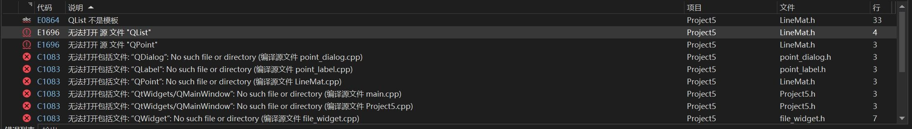
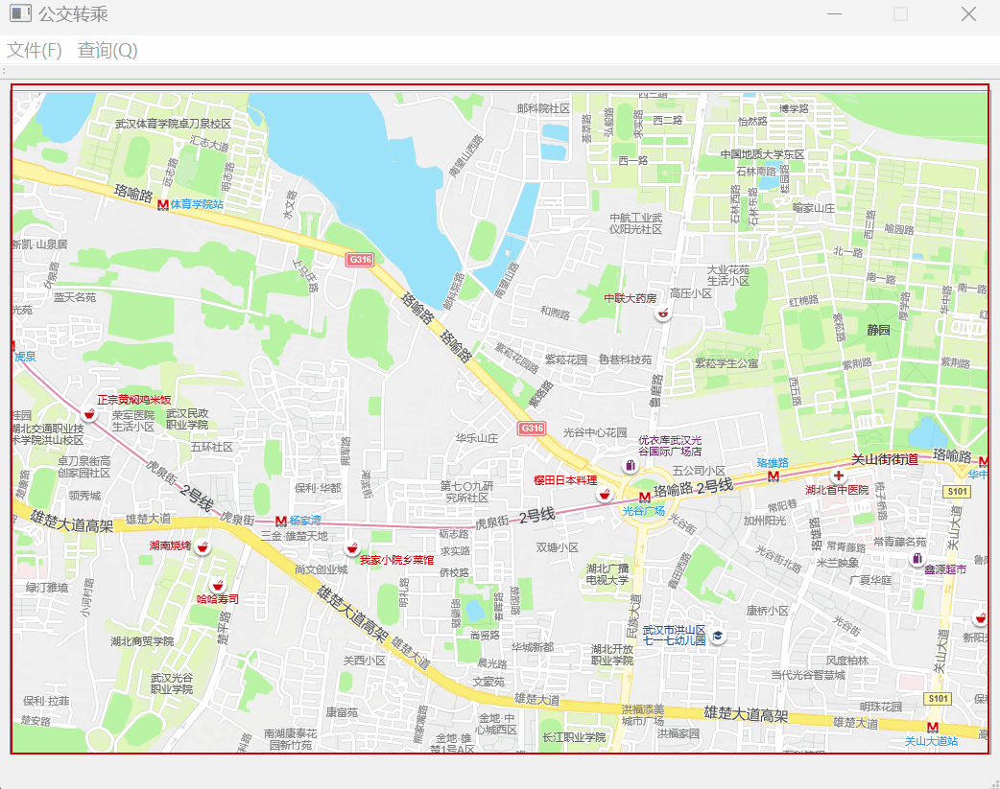
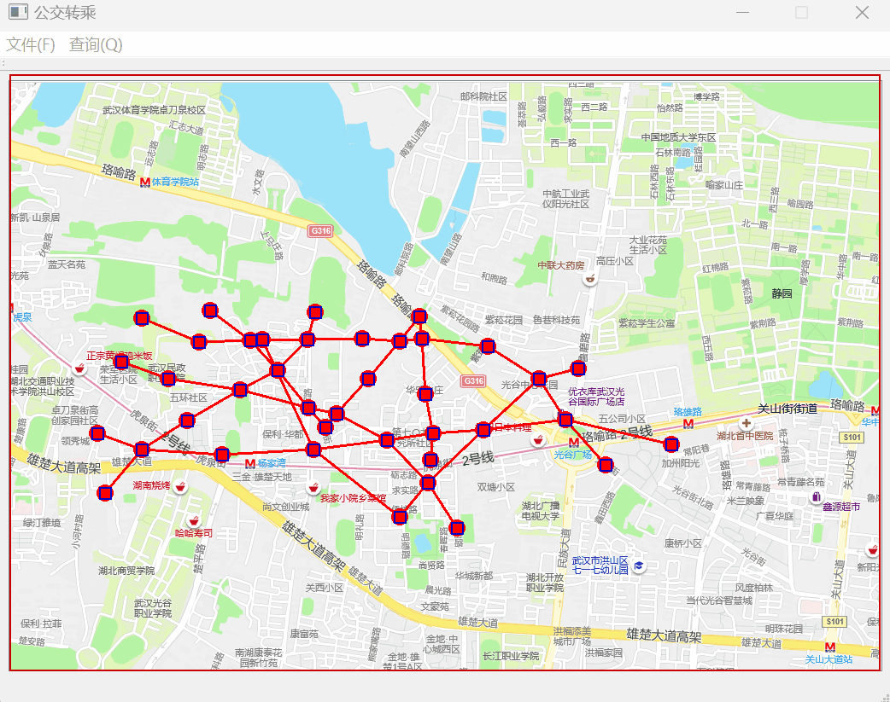
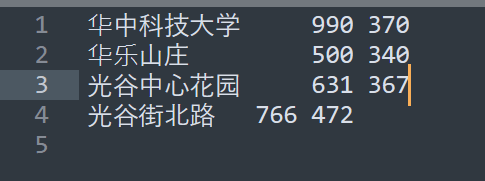
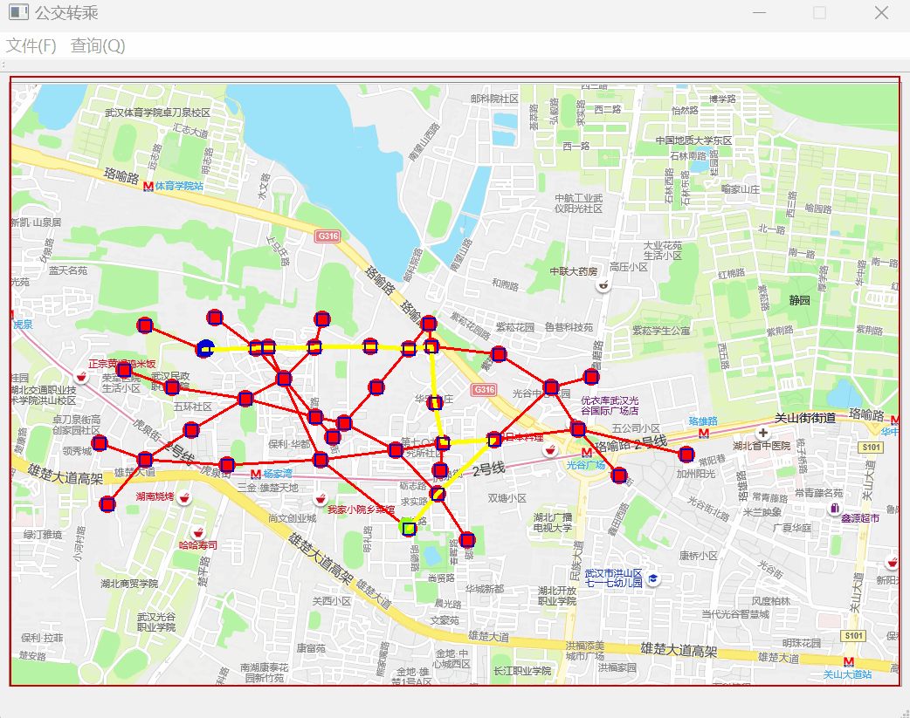
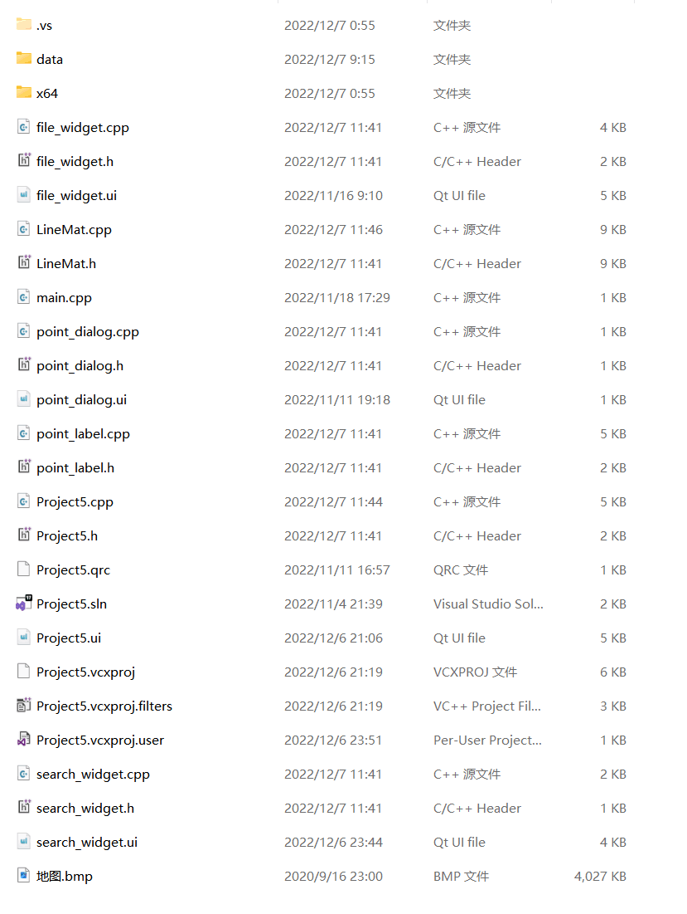
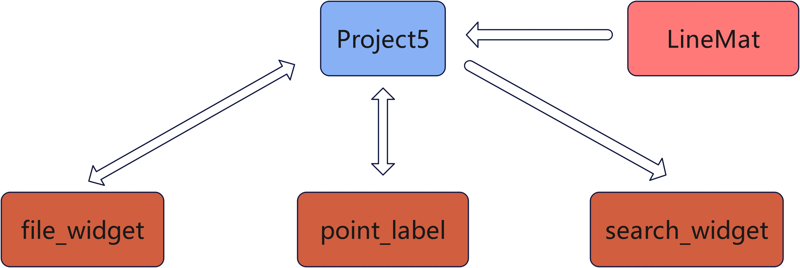
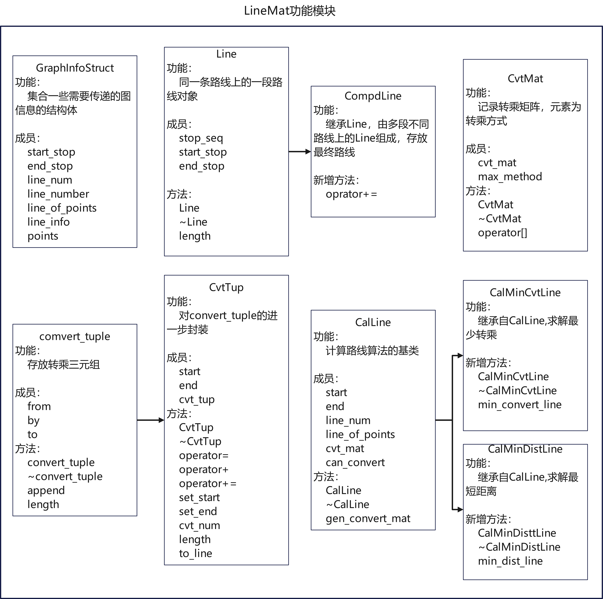

## 运行环境

- vs2022 + qt
- 如果出现下图类似错误，请参考解决方法[找不到源文件解决方法](https://blog.csdn.net/Love_Point/article/details/109104232)



- 其他本版的vs有可能运行报其他错误,可以自行CSDN/知乎

  

## 实现功能

### 读入站点/线路文件

- 站点/线路文件放在`./data`文件夹中。请不要选择`organization.txt`
- 请先确认文件的绝对路径没有中文名。否则会报错(文件选择界面会出现一行小字)



### 鼠标悬浮时显示站点信息

- 当前显示时间为2s
- 显示时不妨碍其他操作~

### 左键/右键选取起点/终点，查询最短距离和最小转乘

- 未设置起点/终点就查询会抛出异常，只能重新运行程序
- 起点为绿色标记(有点难看清)，终点为蓝色标记，路线用黄色标记。可以自己修改



### 通过中文搜索设置起点/终点

- 存在数据库里的站点信息只有这几个(可以自己添加到`organization.txt`)，如果没有任何关键字匹配到会选择🌸科~





## 文件结构

```powershell
D:.
│  file_widget.cpp  // 地图读取模块
│  file_widget.h
│  file_widget.ui
│  LineMat.cpp  // 转乘路线计算
│  LineMat.h
│  main.cpp  // 程序入口
│  point_dialog.cpp  // 鼠标悬浮显示站点信息
│  point_dialog.h
│  point_dialog.ui
│  point_label.cpp  // 前端：将计算得到的点/线刷新到地图界面上
│  point_label.h
│  Project5.cpp  // 调用各个子模块实现功能
│  Project5.h
│  Project5.qrc
│  Project5.sln
│  Project5.ui
│  Project5.vcxproj
│  Project5.vcxproj.filters
│  Project5.vcxproj.user
│  search_widget.cpp  // 搜索功能
│  search_widget.h
│  search_widget.ui
│  地图.bmp
│
├─data  // 数据存放
│      lines.txt
│      organization.txt
│      stops.txt
```



## 设计架构




